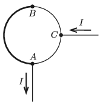

Two pieces of copper wires are soldered together, such that the two pieces form semicircles and together the wires form a circle of radius $r=4$ cm. The diameters of the wires are $d_1 = 3$ mm and $d_2 = 1.5$ mm. To one of the solder points of the closed circle (A) and to the midpoint of the semicircle made of thinner wire (C) very long straight wires are connected (one to each point). Determine the magnetic induction at the centre of the circular wire, when the amperage in the straight wires is $I = 25$ A.

 (4 pont)

