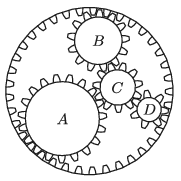

The four inner cogwheels shown in the figure are moving round, whilst the outer one is at rest. (The motion of the cogwheels can be seen on the homepage.)
 What are the values of the number of turns of the cogwheels labelled with the letters $A$, $B$ and $C$ if the smallest cogwheel labelled with $D$ completes a full revolution in each second?

 (5 pont)

