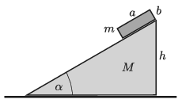

A cuboid of mass $m = 0.5$ kg, base-side $a = 20$ cm and of height $b=10$ cm is initially held at rest on the top of a right-angled inclined plane of mass $M$ shown in the figure. The angle of elevation of the inclined plane is $\alpha= 30^\circ$ and its height is $h= 60$ cm. The cuboid is released at a certain moment. Friction is negligible everywhere.

 $a)$ What is the ratio of the speeds of the two objects when the cuboid touches the ground?
 $b)$ How long does it take for the cuboid to reach the ground?
 $c)$ How much distance is covered by the cuboid?
 (5 pont)

