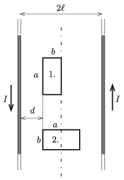

opposite direction. A rectangle-shaped loop of wire is placed in the plane of the two wires at a distance of $d=\ell-b$ from one of the wires, first in position 1 and next in position 2, shown in the figure. The sides of the rectangle are $a$ and $b$, where $0<a-b<\ell$. In which case will the flux linkage of the loop be greater?

 (4 pont)

