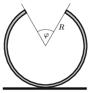

A uniform-density, thin, incomplete cylindrical shell of radius $R$ is placed onto a horizontal tabletop as shown in the figure. The angle at the ``missing part'' of the cylinder is $\varphi$. The cylindrical shell is displaced from its equilibrium position a bit and then released. Determine the period of the oscillation of the shell. Assume that friction is big enough and the shell does not slide during its oscillatory motion.

 Data: $R= 0.2$ m; $\varphi=\pi/3$.
 (5 pont)

