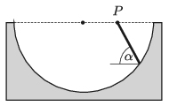

A half-cylinder-shaped trough has a horizontal symmetry axis. Through the midpoint of one of the horizontal radii of the trough an inclined plane of angle of elevation of $\alpha$ is laid. What is the angle of elevation of that slope along which a small object slides without friction in the shortest time?

 (5 pont)

