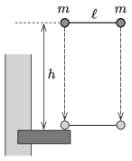

Two small balls each having a mass of $m = 0.25$ kg are tied by means of an $\ell = 60$ cm long thread, which cannot be stretched. The balls are held such that the thread is horizontal and the tension is zero. At a certain moment the two balls are released, without jerking any of them. After a fall of $h = 1.8$ m one of the balls collides with a protruding rigid stone ledge. The collision is totally elastic.

 $a)$ What is the tension in the thread at the moment right after the collision?
 $b)$ How high above the ledge will the ball, colliding with the ledge, be when $t=0.25$ s elapses after the collision?
 (Air drag is negligible.)
 (4 pont)

