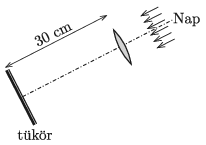

The principal axis of a lens of diameter 10 cm, and of focal length 20 cm points exactly towards the centre of the Sun. A plane mirror is placed 30 cm from the lens as it is shown in the figure. Where should a very small object be placed on the principal axis in order that its temperature increase at the greatest rate? Assuming clear sunny weather how long would it take for a small piece of ice placed to that position to melt provided that the ice is kept in a small aluminium jar covered in black soot? The volume of the ice is $0.1~\mathrm{cm}^3$ and it is at a temperature of $0\;{}^\circ$C. The total energy lost in the lens, in the mirror and on the surface of the bodies, is the 20% of the useful energy. The intensity of the radiation of the Sun at the surface of the Earth is $0.1~\mathrm{W/cm}^2$, and the image of the Sun is smaller than the size of the jar.

 Along the principal axis there is another point at which the ice in the jar melts sooner than at the neighbouring points. Where is this point and how long does it take for the ice to melt there?
 (5 pont)

