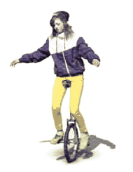

A bicycle-like vehicle with only one wheel, called unicycle, is at rest in an unstable position. We would like to move further with it. To do this we have to speed up first, then we need to move uniformly and then we have to slow down and leave the unicycle in the original unstable position. How do we need to pedal in order not to fall from the unicycle?

 (5 pont)

