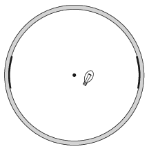

In a 24 cm diameter spherical milk glass lampshade, the small filament of the light bulb is 3 cm from the centre of the sphere. Two real images of the filament, each at a distance of 2 cm from the filament can be formed by the light rays which are reflected several times from the surface of the glass, and which originally travelled along the line which nearly coincides with the line joining the centre of the sphere and the filament, enclosing a small angle with it. How are these images formed and what is the ratio of the size of these images?

 (5 pont)

