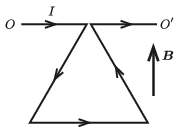

An equilateral triangle is formed from a piece of insulated wire such that it can be rotated frictionlessly along the horizontal axis of $OO'$. The wire is rigid and its mass per unit length is $\lambda$. Initially the plane of the triangle is vertical, and it is in uniform vertical upward magnetic field of induction $\boldsymbol B$. At a certain moment a voltage supply is connected to the system thus a current of $I$ starts to flow in the wire. (Neglect the inductance of the wire.)

 $a)$ At what acceleration does the horizontal side of the triangle begin to move?
 $b)$ After a long enough time what will the angle between the plane of the triangle and the vertical be?
 (5 pont)

