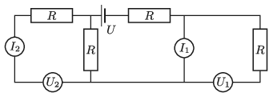

Rudy, who loves physical experimentation, received an electronics kit for his birthday. He immediately assembled the circuit shown in the figure. The internal resistance of the current source of voltage $U = 30$ V is negligible, and the totally alike voltmeters and the totally alike ammeters are considered ideal. The magnitude of the resistances is $R = 50~\Omega$.

 $a)$ What are the readings on the meters?
 $b)$ Then he swapped ammeter 1 for voltmeter 1 and he also swapped ammeter 2 for voltmeter 2. What are the readings on the meters now?
 $c)$ Then he placed back all the meters to their original positions, and then he swapped ammeter 1 for voltmeter 2. What are the readings on the meters in this case?
 (5 pont)

