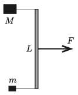

There is a thin rod of length $L=0.6$ m and of negligible mass on a horizontal frictionless surface. Objects of masses $m = 0.2$ kg and $M = 0.8$ kg are attached to the ends of the rod by means of tight threads of negligible mass. The threads are perpendicular to the rod. At a certain moment a force of $F = 8$ N is exerted on the centre of the rod; the force is parallel to the surface and perpendicular to the rod.

 $a)$ Determine the acceleration of the centre of the rod at the initial moment.
 $b)$ At what point of the rod should the force be exerted in order that the two objects have the same acceleration? What are the tensions in the threads in this case?
 (4 pont)

