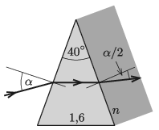

The cross section of a prism is an isosceles triangle with a $40^\circ$ vertex angle, the refractive index of the material of the prism is 1.6. At what angle of incidence $\alpha$ does a light ray reach one of the (slant) faces of the prism, if this ray travels parallel to the base of the triangle inside the prism? To the other slant face of the prism a piece of glass of refractive index $n$ is placed. What is the value of $n$ if the angle of refraction of the previously described light ray emerging from the prism is $\alpha/2$?

 (4 pont)

