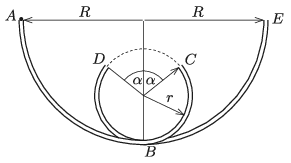

Two quarter circles of radius $R$ are formed from two thin tubes and then two incomplete semi-circle shaped tubes are attached to them. The radius of the semicircles is $r$ and the central angle of the missing part is $\alpha$. Then the whole arrangement is attached to a vertical surface as shown in the figure. Then a small marble is dropped, at zero initial speed into the tube at point $A$. The marble slides along the circular arcs of $AB$ and $BC$, then it falls freely between points $C$ and $D$ (oblique projectile motion). Then the marble slides along the circular arcs of $DB$ and $BE$. (Friction and air drag can be neglected everywhere.)

 $a)$ What is the measure of the angle $\alpha$, if $\frac{R}{r}=\frac{5}{2}$?
 $b)$ Investigate at different $\frac{R}{r}$ ratios at which value (or values) of $\alpha$ is it possible for the marble to execute the above described motion.
 (6 pont)

