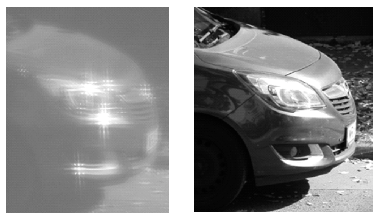

The following two photos were taken of the same car, at the same time. In the first photo the car was photographed through a curtain and in the second without the curtain. The car was at a distance of 20 metres from the curtain.

 How densely woven could the curtain be?
 (5 pont)

