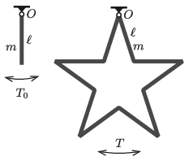

A homogeneous, thin rod of length $\ell$, mass $m$ is suspended by one of its ends. The rod displaced slightly from its equilibrium position is swung with period $T_0=2$ s. Such a rod is called a seconds pendulum.
 $a)$ What is the length of the rods? A rigid frame jointed from such rods shown in the figure is then suspended at one of its corners. This five-pointed star can move freely in its plane about the point $O$.
 $b)$ What is the oscillation period $T$ of the five-pointed star displaced slightly from its equilibrium position?

 (5 pont)

