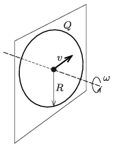

A ring made of a piece of metal wire with a radius of $R=30$ cm is given a charge of $Q=6\cdot10^{-6}$ C and then the ring is rotated in a vacuum at an angular velocity of $\omega=520$ 1/s about an axis which is perpendicular to its plane and goes through the centre of the ring. At a certain moment an electron flies through the centre of the ring in the plane of the ring at a speed of $v=120$ m/s. What is the radius of curvature of the orbit of the electron at the centre of the ring if there the magnetic field of the Earth points in the direction of the velocity of the electron?

 (5 pont)

