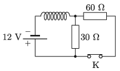

Switch K in the circuit shown in the figure has been closed for a long time. Once the switch is opened. What is the magnitude of the induced electromotive force in the coil immediately after the switch is opened?

 (5 pont)

