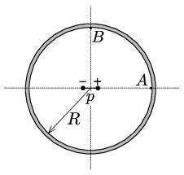

There is a small electric dipole of dipole moment $p$ at the centre of the thin-walled uncharged metal spherical shell of radius $R$, shown in the figure. Determine the surface charge density at points $A$ and $B$, which are interior points of the shell. Determine the surface density of the charge on the outer surface of the shell as well.

 ( Hint : Use the method of image charges applied for a sphere. It might be also useful to know the electric field due to a dipole at a point on the axial and equatorial lines.)
 (6 pont)

