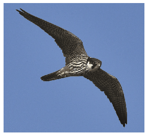

The peregrine falcon can travel long distances without flapping its wing. Doing so, its movement has two parts. In the first part, it circles with its wings extended and rises in an upward flowing column of warm air (thermals) at a vertical speed of $v_1$. In the second part, it leaves the thermal at an angle of $\alpha$ with respect to the horizontal and glides at a constant speed to the next thermal at a distance of $L$. The glide speed $v_2$ is approximately directly proportional to the sine of the angle $\alpha$ (the direction of glide with the horizontal): $v_2=k \sin\alpha$, where $k$ is a known constant.

 $a)$ To what minimum height must a peregrine rise in the thermal so that the time of its rising and gliding motion should be the shortest possible?
 $b)$ At least how much time is needed for the peregrine to move from the bottom of a thermal to the bottom of the next thermal?
 $c)$ Determine the glide angle which belongs to the motion with the optimal flight time.
 Data: $v_1=2~\frac{\mathrm{m}}{\mathrm{s}}$, $k=10~\frac{\mathrm{m}}{\mathrm{s}}$, $L=2$ km.
 (5 pont)

