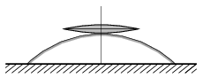

A converging lens with a focal length of 20 cm is placed on a convex spherical mirror as shown in the figure. What should the radius of curvature of the mirror be in order that a vertical parallel beam of light incident on the lens remain parallel after reflection from the system?

 (4 pont)

