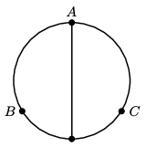

We formed a circle of radius $R$ from a piece of metal wire and from the same wire we made one of the diameters of the circle as well. What should the length of the arcs $AB = AC$ be in order that the equivalent resistance between points $A$ and $B$ be the same as the equivalent resistance between points $B$ and $C$?

 (4 pont)

