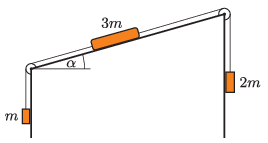

$a)$ At what angle of $\alpha$ is the system in the figure in equilibrium if there is no friction on the slope?

 $b)$ For what angles of $\alpha$ are the objects in equilibrium if the coefficient of friction on the slope is $\mu = 0.2$?
 $c)$ What is the acceleration and the direction of motion of the objects if $\alpha=35^\circ$ and the coefficient of friction is $\mu= 0.15$? What is the ratio of the two tensions in this case?
 (5 pont)

