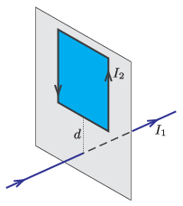

A rectangular frame of wire is placed next to a long, straight conducting wire such that its plane is perpendicular to the wire, as it is shown in the figure. The midpoint of one of the edges of the frame is the closest to the wire, and it is at a distance of $d$ from the wire. Do the two wires attract or repel each other if the straight wire carries a current of magnitude $I_1$ and the conducting frame carries a current of magnitude $I_2$?

 (4 pont)

