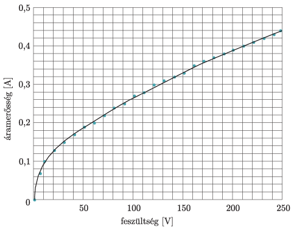
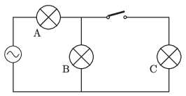

The voltage rating of each of the identical tungsten filament incandescent lamp of the circuit shown in the figure is 230 V. Their current-voltage characteristics are shown in the graph below. The voltage supply in the circuit is 230 V.

 100 W -os villanykörte áram–feszültség karakterisztikája

 $a)$ What is the resistance of an incandescent lamp at its rated voltage?
 $b)$ What is the resistance of the filaments of lamps A and B in the open position of the switch?
 $c)$ What is the resistance of the filaments after the switch is closed?
 $d)$ How much power is dissipated by each incandescent lamp in the above cases?

 (5 pont)

