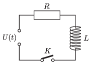

The electromotive force of the voltage supply shown in the figure increases linearly in time after switching on, from an initial value of 0 volts; $U(t)=U_0\frac{t}{t_0}$. The switch K can be closed at any moment to connect the voltage source to the circuit. After the voltage source is turned on, how much time should elapse till the switch is closed so that the current flowing through the resistor also increases linearly in time? At what rate does the current increase then?

 (5 pont)

