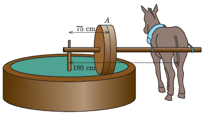

On a Spanish farm, the olives are crushed to a pulp with the olive press shown in the figure. The plane of the crushing wheel, of diameter 90 cm, shown by the dashed line in the figure, is at a distance of 75 cm from the shaft. The wheel rolls without sliding. The tail of the donkey is 180 cm from the shaft, and the donkey undergoes circular motion at a speed of 2.4 m/s. An olive weighing 1 g got stuck to the crushing wheel.

 $a)$ What is the speed of the olive when it is at the topmost point $A$ of the wheel?
 $b)$ what is the acceleration of the olive at this point?
 $c)$ What is the magnitude and the direction of the force exerted by the wheel on the olive when it is at point $A$?
 (5 pont)

