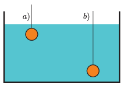

A spherical copper ball at $20\;{}^\circ\textrm{C}$ hanging on a thin insulator string is immersed in a large amount of water at $80\;{}^\circ\textrm{C}$. After a time of $t_1$ the copper ball warms up to $50\;{}^\circ\textrm{C}$. Later the experiment is repeated in such a way that the initial temperature of water is $20\;{}^\circ\textrm{C}$, while the ball is at $80\;{}^\circ\textrm{C}$. In this way the copper ball cools down to $50\;{}^\circ\textrm{C}$ during a time of $t_2$. What is shorter, $t_1$ or $t_2$, if the ball

 $a)$ is just immersed into the water, or
 $b)$ is submerged almost to the bottom of the container?
 (4 pont)

