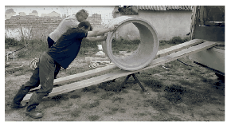

In the picture, you can see workers rolling up a well ring to a lorry along the planks (or they may also roll down the ring, along the planks). The weight of the well ring is 300 kg, the diameter is 1 m, the length of the planks is 5 m, and the height of the lorry platform is 1 m. Assume that the net force exerted by the workers' hands is parallel to the planks, the coefficient of friction between their hands and the well ring is 0.8, and that the well ring does not slide on the plank.

 Determine the minimum force that must be exerted on the concrete well ring parallel to the planks if it is to roll uniformly, without slipping
 $a)$ upward;
 $b)$ downward.
 (5 pont)

