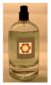

Coloured perfume is marketed in cylindrical bottles with an outer diameter of 4 cm, and a height of 10 cm. The thickness of the wall of the bottle is constant and its material has a refractive index of $n=1.5$. The perfume is placed on the shelf at eye level and backlit. Distant customers see the cylinder as having a wall thickness of zero (the photograph is for illustration purposes only, the shape of the bottle and the wall thickness are different from those described in the exercise). At least how many ml of perfume can be in the bottle?

 (4 pont)

