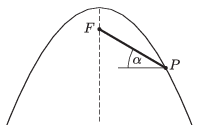

Inclined planes of different angles of inclination are laid through the focus $F$ of a parabola with vertical symmetry axis and opening downtranslwards. What is the angle of inclination of that inclined plane along which a point-like body, starting from the point $F$ without initial velocity and sliding frictionlessly down, reaches the parabola in the shortest possible time?

 (5 pont)

