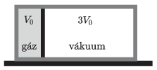

A container with mass $M=32$ kg and volume $V=4~\mathrm{dm}^3$ can move frictionlessly on a horizontal table. It is divided into two parts by a piston of mass $m=16$ kg. On the left side of the piston there is a mixture of gases of volume $V_0=1~\mathrm{dm}^3$, at a pressure of $p_0=0.3$ MPa, and of adiabatic exponent $\kappa=1.5$. On the right side of the piston there is vacuum. What is the relative velocity at which the piston will hit the wall of the cylinder if the piston is released? Assume that the gas is in thermal equilibrium for all the time.

 (5 pont)

