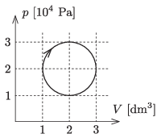

A sample of diatomic gas is taken through the cyclic process which is a circle in the $p$–$V$ diagram, when appropriate units are used, and is shown in the figure.

 Using numerical methods, determine the efficiency of the heat engine which executes the above cyclic process.
 (5 pont)

