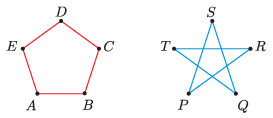

The vertices of a regular pentagon are connected along the sides by wires which have the same resistance, as shown in the figure. In another regular pentagon, we place wires along the diagonals to form a five-pointed star. (The wires are insulated and there are electrical joints only at the vertices of the pentagon.)

 The equivalent resistances measured between adjacent vertices of the two pentagons ($R_{AB}$ and $R_{PQ}$) are the same in the two connections. In which circuit will the equivalent resistance between the vertices of a diagonal ($R_{AC}$ or $R_{PR}$) be greater, and by what factor?
 (4 pont)

