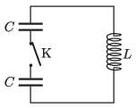

The components of the circuit shown in the figure are ideal. Initially, one of the capacitors is charged to $q_0$, and the other capacitor is uncharged.

 $a$) What is the maximum current after closing switch K?
 $b$) How long after closing the switch does the current first reach its maximum value?
 (5 pont)

