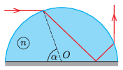

The flat surface of a half-cylinder glass of refractive index $n$ is tin coated. The half-cylinder is illuminated horizontally with a laser beam as shown in the figure. At what value of $\alpha$ will the emerging light beam be exactly vertical? What should the minimum value of $n$ be for such a beam path to be possible?

 (5 pont)

