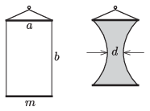

A rectangular frame was constructed with horizontal sides of length $a$ made of rigid, straight pieces of wires each of mass $m$, and vertical sides of length $b$ made of thin, negligible-mass threads.

 The frame was immersed into some dishwashing liquid, holding by one of the wires, and then it was taken out of it. The width of the resulting soap film was reduced to $d$ at the centre. What is the surface tension of the liquid?
 Data: $a=5$ cm, $b=8$ cm, $d=3.6$ cm, $m=2.6$ g.
 (6 pont)

