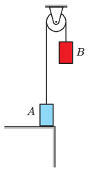

Two identical bodies, each of mass $m$, are connected by a flexible rubber thread, threaded through a stationary pulley of negligible mass. The bodies are held in the position shown in the figure – at this position the rubber band is unstretched – and then body $B$ is released without initial velocity. Body $A$ loses the contact with the table at time $t_0$ after the release of body $B$.

 $a)$ What is the displacement of body $B$ at time $t=t_0$?
 $b)$ How long after the start will the velocity of body $B$ be zero for the first time?
 $c)$ What is the maximum tension exerted in the rubber thread during the motion?
 (5 pont)

