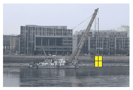

During the rescue of the cargo from a cargo ship that had sunk in the water, by means of a ship crane, a granite sculpture pedestal was lifted from a depth of 4 m, at a constant speed of 0.2 m/s. The pedestal is a solid square based rectangular block made of granite of density $2750~\mathrm{kg/m}^3$, its height is 2 m and its base edge is 1.5 m. Initially the pedestal rests on its square base at the bottom of the riverbed. The granite block is raised until its bottom base is raised 3 m above the surface of the water. During lifting, the longer edges of the pedestal continuously remain in vertical position.
 $a)$ How much work must be done during the whole lifting process?
 $b)$ How did the power of the crane change during the lifting process?

 (4 pont)

