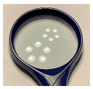

A room is illuminated by a five-arm chandelier, attached to the ceiling. A symmetrical double convex handheld magnifying glass lies on the desk in the room. A glance at the magnifying glass reveals two images of the chandelier at different magnifications and orientations.
 $a)$ How are the two images created?
 $b)$ Into which directions do the arms of the chandelier point in reality?

 (5 pont)

