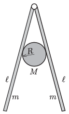

Two identical rough boards are attached to a horizontal fixed axle. Friction between the boards and the axle is negligible. Both boards have a mass $m$ and a length $\ell$.
 A cylinder of mass $M=\frac 12m$ and radius $R=\frac 15\ell$ is placed between the boards.
 $a)$ What must the least value of the coefficient of static friction between the planks and the cylinder be so that the cylinder can remain in equilibrium somewhere (at a suitably chosen point)?
 $b)$ What can the angle subtended by the boards be when the cylinder is in equilibrium?

 (6 pont)

