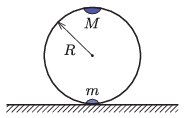

Point-like weights of masses $m$ and $M=2m$ are attached to the two endpoints of the diameter of a circular ring of radius $R$ and of negligible mass. The ring is placed on a tabletop so that it lies in a vertical plane and the weights are along the same vertical line, initially the heavier is above the other, as shown in the figure. The ring is released from this unstable equilibrium state. The friction between the ring and the tabletop is sufficiently high to allow the ring to roll on the tabletop without slipping.

 $a)$ What is the speed of the centre of the ring when the weight of $M$ reaches the lowest point of its trajectory?
 $b)$ What is the downward force exerted on the table in case $a)$?
 (5 pont)

