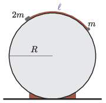

A cylindrical body of radius $R=20~$ cm is fixed in a horizontal position. A piece of light and flexible thread of length $\ell$ was laid on its slippery surface, as shown in the figure.

 To one end of the thread a point-like body of mass $m$, whilst to the other end another point-like body of mass $2m$ were attached. What can the greatest value of $\ell$ be, if the system remains at rest?
 (4 pont)

