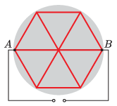

A hob has 12 identical resistance wires, which are connected as shown in the figure.

 What is the percentage distribution of the dissipated power in each of the wires of the hotplate when voltage is applied across points $A$ and $B$?
 (4 pont)

