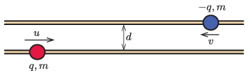

Two horizontal, parallel, frictionless insulating rods are spaced $d$ apart. On the lower rod a small insulating bead of charge $q$ and of mass $m$ slides, and on the upper rod another small insulating bead of charge $-q$ and of mass $m$ slides, as shown in the figure.

 Initially, the beads are spaced far apart and move towards each other with velocities of $u$ and $v$, respectively. What will the maximum velocity of each bead be during the motion?
 (5 pont)

