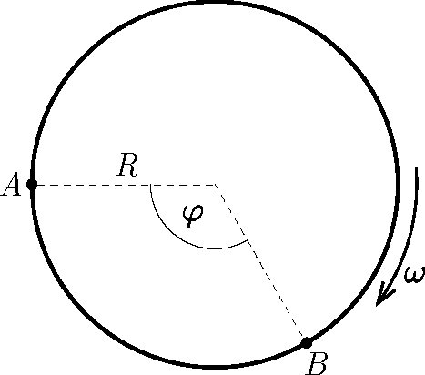

In the Eskimos' Palace of Wonders, there is an igloo of radius of $R=3~\text{m}$ which is built on a circular ice ink, rotating at an angular speed of $\omega=\pi/6~\text{s}^{-1}$ around a vertical axis. Two children are sitting in the rotating igloo in the position shown in the figure, at an angle of $\varphi=120^\circ$ with respect to each other. The child sitting at $A$ manages to launch the puck so that it arrives at the hand of the other child sitting at $B$, in a time of $t=2~\text{s}$ after the launch.

 $a)$ With respect to the igloo at what speed and in what direction did the child at $A$ have to start the puck?
 $b)$ What distance does the puck approach the centre of the igloo as it moves?
 (5 pont)

