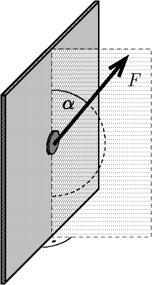

A small, flat fridge magnet weighs $G$. The magnet is placed on the vertical side of the refrigerator and pulled in some direction in a vertical plane perpendicular to the plane of the metal side. The minimum force to move the magnet vertically upwards is $F_1$ and the force to move it vertically downwards is $F_2$.

 $a)$ What is the coefficient of static friction between the side of the refrigerator and the magnet?
 $b)$ What is the force exerted by the metal side on the magnet, when the magnet is not pulled?
 Data: $G=0.10~\text{N}$, $F_1=0.20~\text{N}$ and $F_2=0.05~\text{N}$.
 (See also the exercise numbered

