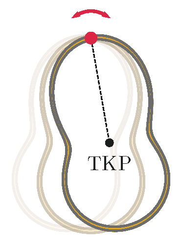

We bend a closed planar curve from a piece of thin wire of uniform mass distribution and of mass $M$. The moment of inertia of the resulting frame is $\Theta_0$ with respect to an axis which passes through the centre of mass and is perpendicular to its plane. The frame is then subjected to an experiment as shown in the figure (the centre of mass is denoted with the letter combination ``TKP"): the frame is suspended at various points and the period of its small amplitude oscillations in its own plane is measured. What is the minimum possible period of the oscillation?

 (5 pont)

