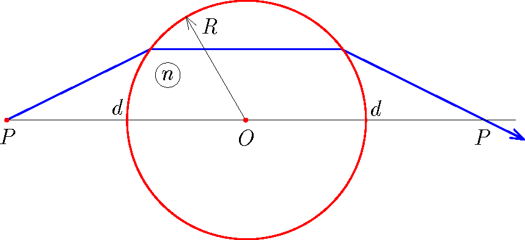

A sphere-shaped lens of radius $R$ and of refractive index $n$ is illuminated with a beam of laser light. Into which direction should the beam of light be directed from a point on the principal axis at a distance $d$ from the centre of the lens, in order that after it refracts on the lens, it crosses the principal axis of the lens also at a distance $d$ from the centre on the other side of the lens? For a given refractive index, for which distance $d$ is this possible? Calculate the angle of the direction of the beam described above using the data of $d=2R$, $n=3/2$.

 (4 pont)

